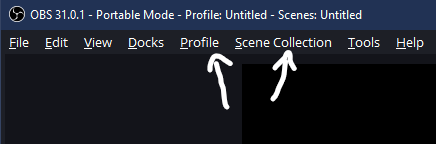

 

<h1 align="center">OBS Tangia Capture Template</h3>

OBS Configuration for capturing Tangia Interactions
 
Created by <a href="https://joshundefined.com">JoshUndefined</a>
|
<a href="https://github.com/joshundefined/obs-tangia-capture/issues/new?labels=bug&template=bug-report---.md">Report Bug</a>

  
Table of Contents

  <ul>
    <li><a href="#about">About</a></li>
    <li><a href="#installation-and-setup">Installation and Setup</a></li>
    <li><a href="#troubleshooting">Troubleshooting</a></li>
  </ul>

## About

A complete configuration template for an OBS installation in [Portable Mode][obs-portable-url] for screen captures of video files for use as [Tangia][tangia-url] Spot Interactions.

Running in OBS portable means that it can be installed and run alongside an existing OBS installation without affecting configurations.

This template will create scenes and a profile for capturing video at 800x800px and limiting audio to -12dBFS.

This project is not affiliated with Tangia or OBS.

Tested with OBS Version 31.0.1

[![Project Screen Shot][project-screenshot]](https://github.com/joshundefined/obs-tangia-capture)

(<a href="#readme-top">back to top</a>)

## Installation and Setup

1. **Backup your existing OBS installation(s) before proceeding**
    1. *Instructions are out of the scope of this tutorial*
1. Download a new copy of [OBS Studio][obs-url]
    1. Download the Zip version 
    
    1. Extract the contents to where you would like to install this version of OBS
    
1. Download [Template Installer][installer-url] from this repository
    
1. Extract the contents to the root directory of the OBS directory 
    
1. Run the script `installTemplate.bat` **within the root directory** which performs the following actions:
    1. Creates a folder `C:\TangiaCapture` where the recordings will be saved
    1. Extracts the template files to patch OBS for Portable Mode and install the Scenes & Profile
    1. Creates shortcuts to both the OBS installation and the Capture folder
1. Run the shortcut to `OBS - Tangia Record` 
    
    1. OBS first-time configuration wizard will appear.
        1. Select "Optimize just for recording"
        1. Other settings may remain default
    1. Change the Profile `Profile -> TangiaRecord`
    1. Change the Scene Collection `Scene Collection -> Tangia Record` 
    
1. In the Sources, configure your Audio and Display capture devices 
    
1. In OBS Settings, select a video and audio encoder
    1. `Settings -> Output -> Recording`
    1. Select a `Video Encoder` and `Audio Encoder`
    1. Adjust the `Encoder Settings`
1. In the OBS Preview, resize and position of the `Display Capture` Source 
    
1. Press `Start Recording` in the OBS Controls 
    
    1. The video recording will be stored at C:\TangiaCapture

(<a href="#readme-top">back to top</a>)

## Troubleshooting

### *When I open this installation of OBS, my old settings are used instead*
- You must run the `installTemplate.bat` script **before** opening OBS or it will use the default installation configuration

### *I can hear the audio doubled while recording*
- On the main OBS window Audio Mixer, Right-Click the `Audio Output Capture` and select `Advanced Audio Properties` 
    
- Change `Audio Monitoring` 
    - **Monitor Off**: Only sends the recorded audio to the output file
    - **Monitor and Output**: Plays the recorded audio to the audio device specified in `Settings -> Audio -> Advanced -> Monitoring Device`
    - **Monitor Only (mute output)**: Does not record any audio **Don't use this as you may still hear the audio during recording causing confusion and frustration*

### *Captured audio sounds strange and the incorrect pitch*
- Ensure `Settings -> Audio -> Sample Rate` matches your system audio settings

### *Who is this JoshUndefined guy and how do I look at the Tangia Interactions he has made*
- Hey there! You can type "JoshUndefined" (or any Tangia creator's name) in the [Tangia Interactions][tangia-interactions-url] page search bar 
 ![Adding Tangia Interactions][tangia-josh-screenshot]

(<a href="#readme-top">back to top</a>)

<!-- Links and images -->
[obs-url]: https://obsproject.com/download
[obs-portable-url]: https://obsproject.com/kb/portable-mode
[tangia-url]: https://www.tangia.co/
[tangia-interactions-url]: https://app.tangia.co/twitch/interactions/create
[installer-url]: dist/OBSTangiaCapture.zip

[project-screenshot]: images/screenshot.png
[tangia-josh-screenshot]: images/tangiajoshscreenshot.png
